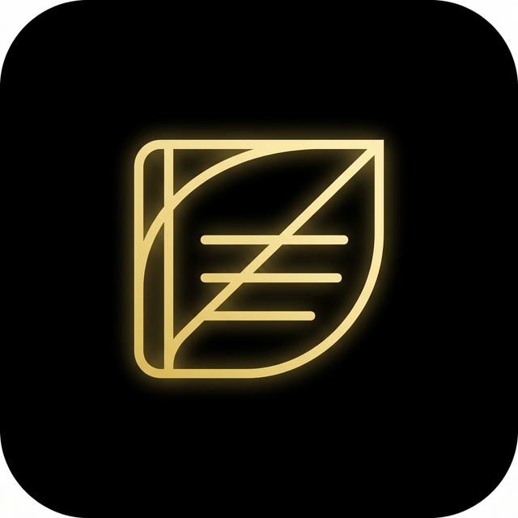

# memo

**Your private garden. Always offline. Always yours.**

&nbsp;

&nbsp;

&nbsp;

---

## Description

**memo** is a private, offline-first journaling app designed to feel as beautiful and fluid as Instagram and X (Twitter) — but completely local. No accounts. No cloud. No tracking. Just a safe, elegant space for your thoughts, photos, voice notes, and memories.

Everything you save stays on your device, forever.

---

## Features

| | Feature | Details |
|:---:|---|---|
| 📝 | **Text Posts** | Write freely with Markdown support (bold, lists, code) |
| 📷 | **Photo Posts** | Capture from camera or gallery — no forced cropping |
| 🎬 | **Video Posts** | Record and play videos natively |
| 🎙️ | **Voice Notes** | Press-and-hold to record with an animated waveform |
| 🌑 | **Deep Black Mode** | True dark mode inspired by X (`#000000`) |
| 🎨 | **Theme Engine** | Light, Dim, Deep Black + custom accent colors |
| 🔒 | **Biometric Lock** | Fingerprint / Face ID with configurable timeout |
| 🛡️ | **The Vault** | AES-256 encrypted `.garden` backup with your own password |
| 👤 | **X-Style Profile** | Cover photo, avatar, bio, posts & media grid tabs |
| 🗂️ | **Memory Lane** | Timeline view of all your past entries |
| 🔍 | **Local Search** | Search posts by text or hashtags — 100% on-device |
| ⚡ | **Haptic Feedback** | Subtle vibrations on key interactions |
| 😌 | **Mood Tags** | Emoji tags to express how you feel |

---

## Download

**[→ Download Latest APK](https://github.com/ahmdmusa/memo/releases/latest)**

1. Click the link above
2. Under **Assets**, tap `memo-*.apk`
3. Transfer to your Android device
4. Install *(enable "Install from unknown sources" if prompted)*

> The APK is built and released automatically on every push via GitHub Actions.

---

## وصف

**memo** هو تطبيق يوميات خاص وأنيق، مستوحى من تجربة Instagram وX — لكنه يعمل بالكامل بدون إنترنت. لا حسابات، لا سيرفرات، لا مراقبة. مجرد مساحة آمنة وجميلة لأفكارك وصورك ومذكراتك الصوتية وذكرياتك.

كل ما تحفظه يبقى على جهازك للأبد.

---

## المميزات

| | الميزة | التفاصيل |
|:---:|---|---|
| 📝 | **بوستات نصية** | اكتب بحرية مع دعم تنسيق Markdown |
| 📷 | **بوستات صور** | التقط من الكاميرا أو اختر من المعرض بدون قص إجباري |
| 🎬 | **بوستات فيديو** | سجّل وشغّل الفيديو مباشرة |
| 🎙️ | **ملاحظات صوتية** | اضغط مطولاً للتسجيل مع موجة صوتية متحركة |
| 🌑 | **الوضع الأسود** | وضع ليلي حقيقي مستوحى من X (`#000000`) |
| 🎨 | **محرك الثيمات** | فاتح / داكن / أسود + ألوان تمييز مخصصة |
| 🔒 | **القفل البيومتري** | بصمة/Face ID مع مهلة قابلة للضبط |
| 🛡️ | **الخزنة** | نسخة احتياطية مشفرة AES-256 بكلمة مرورك |
| 👤 | **بروفايل X** | غلاف، أفاتار، بيو، تاب بوستات وشبكة ميديا |
| 🗂️ | **ممر الذكريات** | تصفّح كل إدخالاتك السابقة في تايملاين |
| 🔍 | **بحث محلي** | ابحث بالنص أو الهاشتاق — على جهازك مباشرة |
| ⚡ | **ردود لمسية** | اهتزازات خفية عند التفاعلات الأساسية |
| 😌 | **تاجات المزاج** | إيموجي يعبّر عن حالتك |

---

## التحميل

**[← تحميل أحدث نسخة](https://github.com/ahmdmusa/memo/releases/latest)**

1. افتح الرابط أعلاه
2. تحت **Assets**، اضغط على `memo-*.apk`
3. نقّله لهاتفك وثبّته *(فعّل "تثبيت من مصادر غير معروفة" إذا طُلب)*

> الـ APK يُبنى ويُنشر تلقائياً عند كل رفع عبر GitHub Actions.

---

Built with ❤️ by **Ahmed Musa**

  
  

